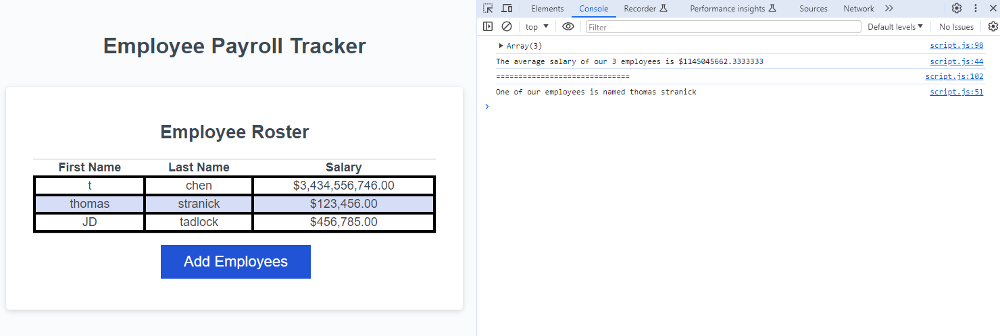

# employee_payroll_tracker
## Author: Thomas Stranick

## Description

This payroll tracker was created to provide the user insight into their employees salaries and who their employees are. The website prompts the user to input their employees along with their salaries so it can display it on a table within the page in order of last name alphabetically. The console then shows the average salary between all employees as well as a random employee's first and last name. Within this challenge, I learned more about the DOM and how we can ask users for information to use within the webpage as well as modify attributes that are already existing within it. I also learned about other useful JavaScript like string literals, objects, and for of loops.

## Visuals

## Deployment

Provided as a link here - [Employee-Payroll-Tracker](https://github.com/ThStranick15/employee_payroll_tracker)

## Usage

To use the webpage, the user can select the add employee button, which will prompt them for input on the employee's first name, last name, and salary. The prompt will then ask if they want to continue adding employees, which they can continue or end the process. Once the process ends, the employees along with their salaries will be displayed within the table alphabetically by last name. Within the console, the average salary of all employees inputted, along with one random employee, will be displayed as well.

## Credits

- JD (Bootcamp Instructor) - demo on some js useful for challenge

## License

Please refer to the LICENSE in the repo.